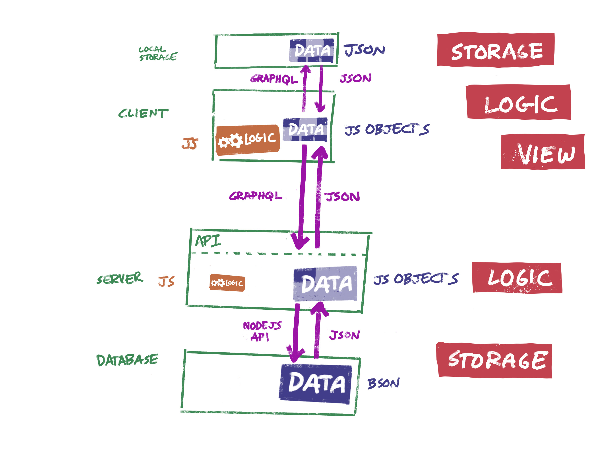
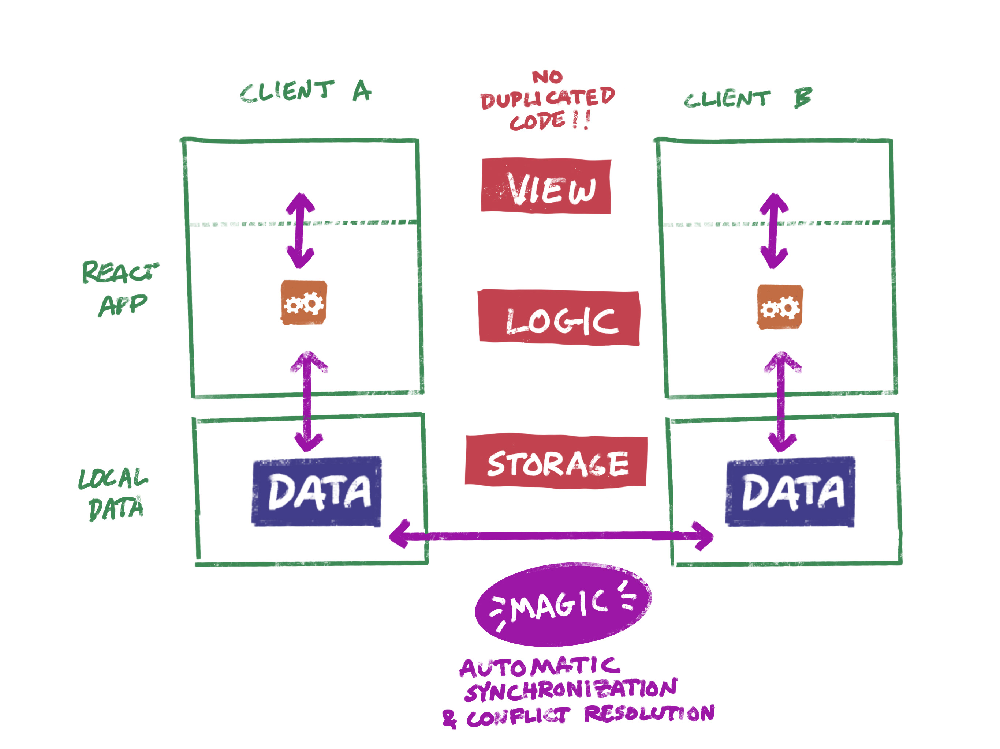
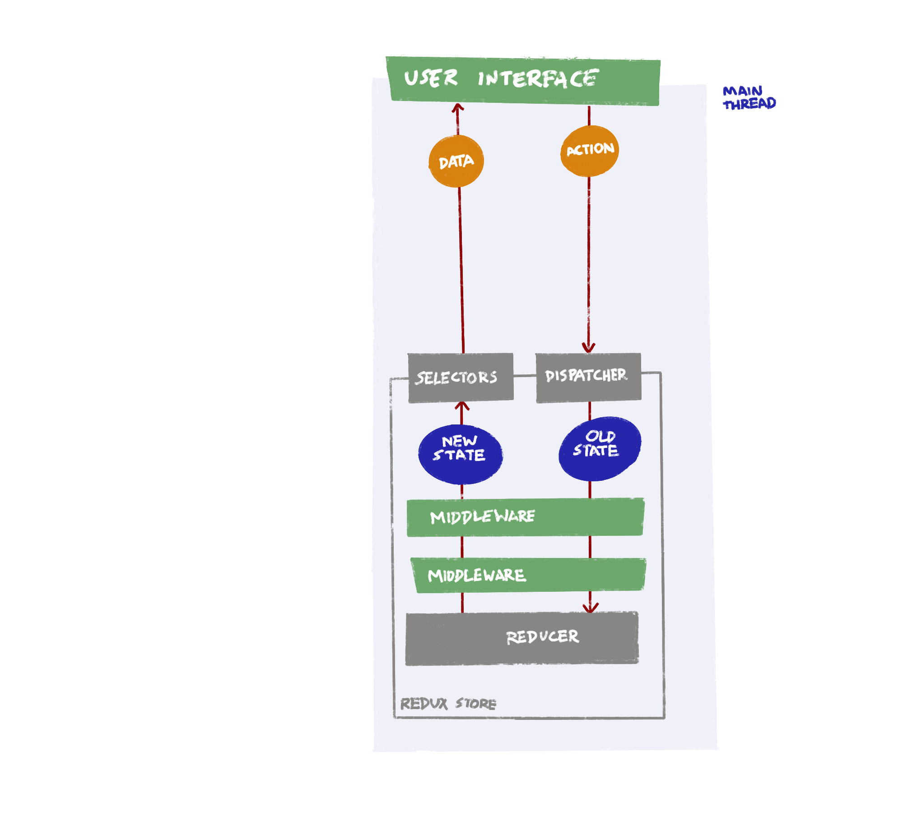
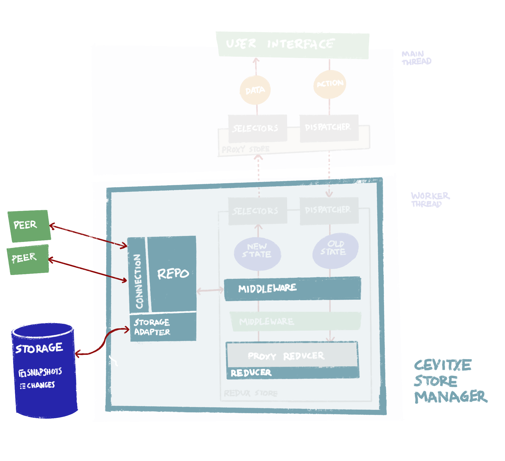

Cevitxe is a wrapper for a Redux store that gives your app offline capabilities
and secure peer-to-peer synchronization superpowers.

## Why?

There are a lot of reasons to build an app that works in a distributed way, without depending on a
centralized server:

- Suppose you want to build a web application where the **data doesn't live on a remote host**, but
  is shared from **peer to peer**.

- Or, you want to create an app that **works offline**, and **syncs up** with changes by other users
  when it comes back online.

- Or, you want to go **local-first** to **eliminate latency**, by keeping a complete copy of a
  user's data on their machine, which you then replicate to other users in the background.

| </img>               | </img>                    |
| ---------------------------------------------- | --------------------------------------------------- |
| <sub>A typical client-server application</sub> | <sub>A distributed (peer-to-peer) application</sub> |

A typical web application developer today is likely to be comfortable working with databases and API
endpoints on the server, along with state containers like Redux on the client. A distributed
architecture is compelling for all the reasons listed above, but it puts us in very unfamiliar territory.
Without a server, how do peers talk to each other? Where is the data stored? How do we make sure
that concurrent (and possibly conflicting) changes get replicated correctly between peers?

Cevitxe intends to **bridge that gap** by combining the **familiar interface** of a Redux store with
**peer-to-peer networking**, **offline capabilities**, and **automatic synchronization** and conflict
resolution superpowers.

## How?

### Data replication & synchronization

What all of the above scenarios have in common is that you need to **keep independent replicas of a
dataset in sync** with each other, without counting on an all-knowing server to serve as a single
source of truth.

- **Conflict-free replicated data types**
  ([CRDTs](https://en.wikipedia.org/wiki/Conflict-free_replicated_data_type)) are data structures that
  solve this problem in a way that is mathematically proven to **guarantee eventual consistency**.

- [**Automerge**](http://github.com/automerge/automerge) is a
  JavaScript library that makes it possible to turn any JSON object into a CRDT.

Automerge keeps track of a dataset's history using an append-only log of changes. You can think of
it as **Git for JSON data structures**. Different actors generate a stream of changes (analogous to
Git commits). Unlike Git, though, Automerge **automatically resolves conflicts**. Automerge's
conflict resolution is

- **arbitrary**;
- **deterministic** (two actors will always resolve any given conflict in the same way, without
  communicating with each other);
- **non-destructive** (a record of a conflict is embedded in the document's metadata, so that an
  application can surface it for human attention if necessary); and
- **rarely necessary** (conflicts only occur when two actors concurrently modify the same
  property of the same element of the same document).

Let's assume you have an application that works with one or more JSON documents. For example, a
single "document" might represent a task list, a row in a spreadsheet-like table, or a chat conversation.

Cevitxe exposes a repository of documents to your application as a **Redux store**. Internally, each
one is represented by both a snapshot of its current state and a history of Automerge changes.

| </img> | </img> |
| ------------------------------------ | ----------------------------------------- |
| <sub>Redux</sub>                     | <sub>Redux & Cevitxe</sub>                |

### Networking

In the background, whenever you are online, Cevitxe connects to any peers that are using the same
repository, sending out a stream of changes as the user modifies the dataset, and applying incoming
changes from peers.

To discover peers, Cevitxe provides a lightweight [signal server](packages/cevitxe-signal-server).

### Persistence

Each peer stores the entire repository locally, in the form of a complete history of changes for
each document, along with a snapshot of each document's most recent state. By default IndexedDB is
used, but you can use any of the provided adapters, or build your own.

Cevitxe currently includes the following data storage adapters:

- IndexedDb

## Running the examples

Three demo React applications are included. Source code is in the `examples` directory. You can run
each one with the appropriate `yarn start` command:

| `yarn start:grid`                             | `yarn start:todo`                              | `yarn start:chat`                             |
| --------------------------------------------- | ---------------------------------------------- | --------------------------------------------- |
|  |  |  |
| <sub>A simple table editor</sub>              | <sub>An implementation of TodoMVC</sub>        | <sub>A chat channel</sub>                     |

If you are working on the Cevitxe code and/or the code for one of the demo apps, you can start in
watch mode by running `yarn dev` instead:

- `yarn dev:grid`
- `yarn dev:todo`
- `yarn dev:chat`

In each case the app will run on `localhost:3000`. (You can only run one example app at a time).

To test the peer-to-peer functionality on a single computer, visit the demo in two different
browsers (e.g. Chrome and Firefox), or with a normal window and an incognito window of the same
browser.

(You can of course run in two normal tabs of the same browser, but they'll share the local
IndexedDb, so you're not really testing their ability to communicate.)

Copy the ID from one browser window and paste it into the other, then press **Join**.
After a brief delay, you should have the same state visible in both instances, and changes made in
one should be replicated to the other.


## Getting started

Cevitxe works in the **browser** and in **Node.js**. The examples given are React apps, and the Toolbar
component they all use is a React component. The store that Cevitxe exposes is a Redux store; it can
be used by any JavaScript application, not just those using React.

> **TODO:** once we settle on a better collections API, update docs to show how this would be used
> with a single state document, and how it would be used with a collection

#### Add Cevitxe as a dependency

```bash
yarn add cevitxe
```

#### Instantiate Cevitxe

A typical app just needs one instance of Cevitxe, which can be used to manage any number of
documents.

```js
import { StoreManager } from 'cevitxe'
import { proxyReducer } from '../reducer'
import { ALL } from '../constants'

const cevitxe = new Cevitxe({
  // See below to learn what a proxy reducer is
  proxyReducer,

  // Pass an initial state, just like you would for Redux
  initialState: {
    todoList: [],
    todoMap: {},
    filter: ALL,
  },

  // Point it to known signal server instances
  peerHubs: [
    'https://signalserver.myapplication.com/',
    'https://signalserver-qrsxyz.now.sh/', //..
  ],
})
```

> **TODO:** example with all the options that you can pass the Cevitxe constructor

#### Use Cevitxe to create your store

The Cevitxe object creates your Redux store. It's a plain old Redux store that you can use in your
app the way you always have.

There are two ways to get a store: You can **create** one, or you can **join** one.

Either way you need a **discovery key**. This key can be any string that uniquely identifies a
document. Typically this is a UUID, but it doesn't have to be as long as you're confident it's
unique. It's your app's responsibility to give the user the option of creating a new document or
joining an existing one, and managing the keys associated with documents.

```js
export const App = () => {
  // if you're creating a store
  const store = cevitxe.createStore(discoveryKey)

  // OR if you're joining a store
  // const store = cevitxe.joinStore(discoveryKey)

  return (
    <Provider store={store}>
      <App />
    </Provider>
  )
}
```

#### Proxy reducers for Automerge are different from ordinary Redux reducers

Automerge and Redux both treat state as immutable, but use different mechanisms for modifying state.

Redux reducers take a previous state object and an action, and construct a new state object to return.

```js
const reducer = (state, {type, payload}) =>
  switch (type) {
    case SET_FILTER:
      return {
        ...state
        filter: payload.filter
      })

    case ADD_TODO: {
      const { id, content } = payload
      return {
        ...state,
        todoList: state.todoList.concat(id),
        todoMap: {
          ...state.todoMap,
          [id]: {
            content: content,
            completed: false,
          },
        }
      }
    }

    // ... etc.

    default:
      return state

  }
}
```

In an Automerge change callback, you're given a
[proxy](https://developer.mozilla.org/en-US/docs/Web/JavaScript/Reference/Global_Objects/Proxy) to
the current state. Inside the callback, you modify the state as if it were mutable. You don't need
to return anything; Automerge translates your modifications to a set of changes, and uses that to
construct the new state.

If you were using Automerge directly, this is what that would look like:

```js
newState = A.change(prevState, s => {
  // `s` is a mutable proxy to the contents of `prevState`
  s.filter = someNewValue
})
```

(For more details on how you would use Automerge directly, see [here](https://github.com/automerge/automerge#manipulating-and-inspecting-state).)

With Cevitxe, you collect these change functions into something that looks a lot like a Redux
reducer.

```js
const proxyReducer = ({ type, payload }) => {
  switch (type) {
    case SET_FILTER:
      return state => (state.visibilityFilter = payload.filter)

    case ADD_TODO: {
      const { id, content } = payload
      return state => {
        state.todoList.push(id)
        state.todoMap[id] = { id, content, completed: false }
      }
    }

    // ... etc.

    default:
      return null
  }
}
```

But there are three important differences between a proxy reducer and an ordinary Redux reducer:

- A **Redux reducer**'s signature is `(state, action) => state`: You take the old state and an action,
  and you **return the new state**. The **proxy reducer**'s signature is `action => state => void`: You take
  the action and **return a change function**, which in turn recieves a proxy to the old state. You
  modify the proxy, and the proxy communicates the changes you make to the framework.
- The fallthrough case in a proxy reducer is `null` (no change function found), rather than the original
  `state` value.
- Since you don't need to return anything, you don't need to reconstruct all the bits of the state
  tree that aren't affected by any given reducer. In Redux you might end up having to do something
  like this to modify a deeply nested bit of state while leaving the rest unchanged:

  ```js
  case TOGGLE_TODO: {
    const { id } = payload
    return {
      ...state,
      todoMap: {
        ...state.todoMap,
        [id]: {
          ...state.todoMap[id],
          completed: !state.todoMap[id].completed,
        },
      }
    }
  }
  ```

  A proxy reducer just modifies what it needs to:

  ```js
    case TOGGLE_TODO: {
      const { id } = payload
      return state => (state.todoMap[id].completed = !state.todoMap[id].completed)
    }
  ```

Internally, Cevitxe turns the proxy into a straight-up Redux reducer.

## Limitations

Cevitxe requires that the entire repository be present on each peer's machine. That means that it is
limited to datasets that can fit comfortably within the disk space on a single computer. In 2019,
that means something on the order of 1-10 GB.

## Work in progress

- [ ] **Run in worker process**  
       Enable running Cevitxe's `StoreManager` entirely in a web worker process. All the Automerge,
      local storage and sync components would live in the worker, thus freeing the UI context of all the
      expensive overhead of the system. We'll need a coarse-grained query API to query and retrieve
      a view of a set of rows, aggregate information, etc. [#45](https://github.com/DevResults/cevitxe/issues/45)
  - [ ] order + range / count
  - [ ] filter
  - [ ] aggregation, projection, etc. (might be entirely out of scope)

* [ ] **Deployable always-on superpeer**  
       In a peer-to-peer network where clients are only online intermittently and updates can only
      happen when two peers happen to be online at the same time, it can take a while for updates to
      propagate. One solution would be to leave a client running on a computer that's never turned
      off. We'd like to provide a "superpeer" (don't call it a server!!) that can be inexpensively
      deployed using the command line to cloud hosting providers. [#41](https://github.com/DevResults/cevitxe/issues/41)

* [ ] **More storage adapters**  
       We currently only provide browser-based persistent storage using IndexedDb. A superpeer
      running in a serverless function would need access to a third-party hosted datastore like
      Redis, MongoDB or DynamoDB. An installable Electron app might prefer to work with
      self-contained, portable documents in the file system; or with a database like Sqlite. [#42](https://github.com/DevResults/cevitxe/issues/42)

  - [x] IndexedDb
  - [ ] Sqlite
  - [ ] File system
  - [ ] Redis
  - [ ] MongoDB
  - [ ] AWS DynamoDB

* [ ] **Security** The signal server currently doesn't require authentication; anyone who knows its
      URL and the discovery key of a document can connect to it. We have some thoughts about how to
      implement authentication and authorization: See [#37](https://github.com/DevResults/cevitxe/issues/37) and [#38](https://github.com/DevResults/cevitxe/issues/38).

* [ ] **Direct browser-to-browser connections**  
       For now, besides introducing two peers to each other, **the signal server also serves as a
      relay**, piping their two WebSocket connections together. In the future, Cevitxe will
      establish a direct connection between the two peers, using browser-to-browser communication
      technologies like WebRTC. For now, we've found WebRTC too unreliable to be worth the trouble. [#43](https://github.com/DevResults/cevitxe/issues/43)

* [ ] **Command-line deployment for signal server**  
       We've manually gotten our signal server up and running on Heroku. We'd like to script this
      and/or include configuration files to make it possible to deploy instances of the signal
      server to multiple providers such as Heroku, Zeit Now, and Netlify. [#44](https://github.com/DevResults/cevitxe/issues/44)

* [ ] **Swarm of signal servers**  
       Currently if we see a configuration with more than one URL for signal servers, we just pick
      the first one. That's because we don't currently support having more than one signal server
      per discovery key. (If Alice talks to signal server X and Bob talks to signal server B,
      they'll never be introduced even if they have the same discovery key.) That's because servers
      don't know anything about each other. We'd like to implement a swarm such that any number of
      signal servers can be deployed, and the user will be directed to the best one. [#27](https://github.com/DevResults/cevitxe/issues/27)

## Alternatives

All of these projects are working in similar problem space, in JavaScript. All work in Node.js and
the browser unless otherwise noted.

- [Hypermerge](inkandswitch/hypermerge) is the semi-official networking and persistence stack for
  Automerge, based on the [DAT project](http://dat.foundation)'s
  [Hypercore](http://github.com/mafintosh/hypercore) and created by the team at Ink and Switch. It's
  used in sample Automerge applications like [Capstone](http://github.com/inkandswitch/capstone) and
  [Farm](http://github.com/inkandswitch/farm). Node.js only.
- [PouchDb](https://pouchdb.com) Syncs with [Apache CouchDb](https://couchdb.apache.org).
- [Realm Database](https://realm.io/products/realm-database/) Acquired by MongoDB in 2019. Node.js only.
- [HyperDB](https://github.com/mafintosh/hyperdb) From the DAT Project. Showcased in a cool sample
  app by @jimpick: [Dat Shopping List](https://blog.datproject.org/2018/05/14/dat-shopping-list/).
- [GunDB](https://gun.eco) Distributed graph database.

## Frequently asked questions

#### Where can I learn more about this whole CRDT/distributed/local-first thing?

Here are some articles and videos:

- [CRDTs and the Quest for Distributed
  Consistency](https://www.youtube.com/watch?v=B5NULPSiOGw), a great talk by [Martin Kleppman](@ept), the
  author of Automerge.
- [Local-first software: You own your data, in spite of the
  cloud](https://www.inkandswitch.com/local-first.html), a manifesto published by Ink & Switch, the
  industrial research lab created by Heroku alumni that is behind Automerge.
- [A web application with no web server?](https://medium.com/all-the-things/a-web-application-with-no-web-server-61000a6aed8f)

#### Why is this package called Cevitxe?

- [CVI.CHE 105](https://www.google.com/search?q=cvi.che+105&tbm=isch) is a restaurant in Miami, where
  the authors of this package ate the night before starting it.
- [Ceviche](https://en.wikipedia.org/wiki/Ceviche) is the Peruvian style of preparing raw fish
  marinated in citrus along with _ají_, onions, and cilantro.
- [Cevitxe](https://www.facebook.com/bentrobats/videos/1492898280822955/) is the Catalan spelling of
  the same word, and is pronounced the same way. (@herbcaudill lives in Barcelona; and the
  distinctive spelling was free on NPM and makes the project easier to Google.)

## Maintainers

- @brentkeller
- @diegose
- @herbcaudill
