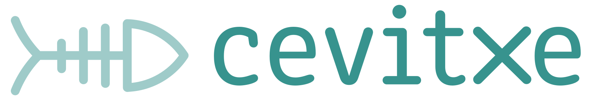
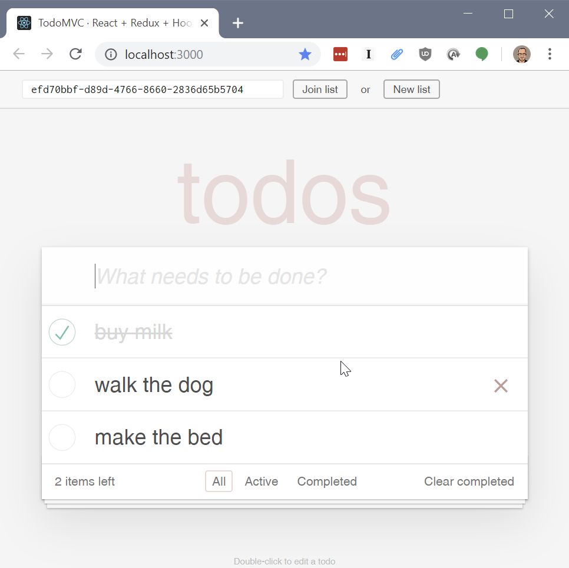
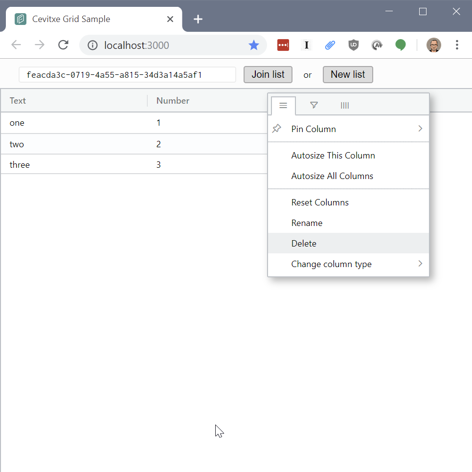

Cevitxe is a wrapper for a Redux store that gives your app offline capabilities and secure
peer-to-peer synchronization superpowers.

## Why?

Distributed, offline-first technologies are promising for a lot of reasons, but they're unfamiliar
to most web application developers. Cevitxe provides offline storage and peer-to-peer
synchronization capabilities, and exposes them via a familiar Redux store that can be used in a
vanilla JS, React, or Electron application.

🡒 [Read more](docs/why.md)

## How?

Cevitxe provides three services:

- **Data replication & synchronization**, using the [Automerge](https://github.com/automerge/automerge) library
- **Networking** with peers, via a lightweight [signal server](../packages/cevitxe-signal-server) for discovery and relay
- **Persistence** to a local or remote data store. You can use the provided adapters for [IndexedDb](../packages/cevitxe-storage-indexeddb) or [MongoDb](../packages/cevitxe-storage-mongodb), or provide your own.

🡒 [Read more](docs/how.md)

## Getting started

### Run the examples

Two demo React applications are included:

<table>
  <tr>
    <td>
      <h4><code>cevitxe-example-todo</code></h4>
       
      <p>An implementation of TodoMVC</p> 
      <p>To run: <code>yarn dev:todo:start</code> </p> 
    </td>
    <td>
      <h4><code>cevitxe-example-grid</code></h4>
       
      <p>A simple table editor</p> 
      <p>To run: <code>yarn dev:grid:start</code> </p>
    </td>
  </tr>
</table>


### Use Cevitxe in your app

```bash
yarn add cevitxe
```

```js
import { StoreManager } from 'cevitxe'
import { Provider } from 'react-redux'

const storeManager = new StoreManager({
  // Pass your reducers
  proxyReducer,

  // Pass an initial state, just like you would for Redux
  initialState: {
    todoList: [],
    todoMap: {},
    filter: ALL,
  },
})

export const Index = () => {
  // Obtain a Redux store
  const store = storeManager.createStore(discoveryKey)
  return (
    // Pass the store to your app
    <Provider store={store}>
      <App />
    </Provider>
  )
}
```

🡒 [More on how to use Cevitxe in your app](docs/getting-started.md)

## Work in progress

- [ ] **Run in worker process**  
       Enable running Cevitxe's `StoreManager` entirely in a web worker process. All the Automerge,
      local storage and sync components would live in the worker, thus freeing the UI context of all the
      expensive overhead of the system. We'll need a coarse-grained query API to query and retrieve
      a view of a set of rows, aggregate information, etc. [#45](https://github.com/DevResults/cevitxe/issues/45)
  - [ ] order + range / count
  - [ ] filter
  - [ ] aggregation, projection, etc. (might be entirely out of scope)

* [ ] **Deployable always-on superpeer**  
       In a peer-to-peer network where clients are only online intermittently and updates can only
      happen when two peers happen to be online at the same time, it can take a while for updates to
      propagate. One solution would be to leave a client running on a computer that's never turned
      off. We'd like to provide a "superpeer" (don't call it a server!!) that can be inexpensively
      deployed using the command line to cloud hosting providers. [#41](https://github.com/DevResults/cevitxe/issues/41)

* [ ] **More storage adapters**  
       We currently only provide browser-based persistent storage using IndexedDb. A superpeer
      running in a serverless function would need access to a third-party hosted datastore like
      Redis, MongoDB or DynamoDB. An installable Electron app might prefer to work with
      self-contained, portable documents in the file system; or with a database like Sqlite. [#42](https://github.com/DevResults/cevitxe/issues/42)

  - [x] IndexedDb
  - [ ] Sqlite
  - [ ] File system
  - [ ] Redis
  - [x] MongoDB
  - [ ] AWS DynamoDB

* [ ] **Security** The signal server currently doesn't require authentication; anyone who knows its
      URL and the discovery key of a document can connect to it. We have some thoughts about how to
      implement authentication and authorization: See [#37](https://github.com/DevResults/cevitxe/issues/37) and [#38](https://github.com/DevResults/cevitxe/issues/38).

* [ ] **Direct browser-to-browser connections**  
       For now, besides introducing two peers to each other, **the signal server also serves as a
      relay**, piping their two WebSocket connections together. In the future, Cevitxe will
      establish a direct connection between the two peers, using browser-to-browser communication
      technologies like WebRTC. For now, we've found WebRTC too unreliable to be worth the trouble. [#43](https://github.com/DevResults/cevitxe/issues/43)

* [ ] **Command-line deployment for signal server**  
       We've manually gotten our signal server up and running on Heroku. We'd like to script this
      and/or include configuration files to make it possible to deploy instances of the signal
      server to multiple providers such as Heroku, Zeit Now, and Netlify. [#44](https://github.com/DevResults/cevitxe/issues/44)

* [ ] **Swarm of signal servers**  
       Currently if we see a configuration with more than one URL for signal servers, we just pick
      the first one. That's because we don't currently support having more than one signal server
      per discovery key. (If Alice talks to signal server X and Bob talks to signal server B,
      they'll never be introduced even if they have the same discovery key.) That's because servers
      don't know anything about each other. We'd like to implement a swarm such that any number of
      signal servers can be deployed, and the user will be directed to the best one. [#27](https://github.com/DevResults/cevitxe/issues/27)

## Limitations

Cevitxe requires that the entire repository be present on each peer's machine. That means that it is
limited to datasets that can fit comfortably within the disk space on a single computer. In 2019,
that means something on the order of 1-10 GB.

## Further reading

- [CRDTs and the Quest for Distributed
  Consistency](https://www.youtube.com/watch?v=B5NULPSiOGw), a great talk by [Martin Kleppman](@ept), the
  author of Automerge.
- [Local-first software: You own your data, in spite of the
  cloud](https://www.inkandswitch.com/local-first.html), a manifesto published by Ink & Switch, the
  industrial research lab created by Heroku alumni that is behind Automerge.
- [A web application with no web server?](https://medium.com/all-the-things/a-web-application-with-no-web-server-61000a6aed8f)

## Alternatives

All of these projects are working in similar problem space, in JavaScript. All work in Node.js and
the browser unless otherwise noted.

- [Hypermerge](inkandswitch/hypermerge) is the semi-official networking and persistence stack for
  Automerge, based on the [DAT project](http://dat.foundation)'s
  [Hypercore](http://github.com/mafintosh/hypercore) and created by the team at Ink and Switch. It's
  used in sample Automerge applications like [Capstone](http://github.com/inkandswitch/capstone) and
  [Farm](http://github.com/inkandswitch/farm). Node.js only.
- [PouchDb](https://pouchdb.com) Syncs with [Apache CouchDb](https://couchdb.apache.org).
- [Realm Database](https://realm.io/products/realm-database/) Acquired by MongoDB in 2019. Node.js only.
- [HyperDB](https://github.com/mafintosh/hyperdb) From the DAT Project. Showcased in a cool sample
  app by @jimpick: [Dat Shopping List](https://blog.datproject.org/2018/05/14/dat-shopping-list/).
- [GunDB](https://gun.eco) Distributed graph database.
