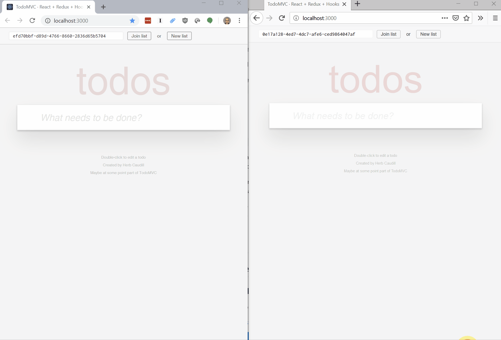

## Getting started

On this page:

- [Running the examples](#running-the-examples)
- [Using Cevitxe in an application](#using-cevitxe-in-an-application)
  - [Add Cevitxe as a dependency](#add-cevitxe-as-a-dependency)
  - [Create a store manager](#create-a-store-manager)
  - [Use the store manager to create your store](#use-the-store-manager-to-create-your-store)
- [Differences from Redux](#differences-from-redux)
  - [Reducers vs proxy reducers](#reducers-vs-proxy-reducers)
  - [Collections](#collections)

### Running the examples

Two demo React applications are included. Source code is in the `examples` directory. You can run each one with the appropriate `yarn start` command:

<table>
  <tr>
    <td>
      <h4><code>todo</code></h4>
       
      <p>An implementation of TodoMVC</p> 
      <p>To run: <code>yarn start:todo</code> </p> 
      <p>To run in dev mode: <code>yarn dev:todo</code> </p> 
    </td>
    <td>
      <h4><code>grid</code></h4>
       
      <p>A simple table editor</p> 
      <p>To run: <code>yarn start:grid</code> </p>
      <p>To run in dev mode: <code>yarn dev:grid</code> </p>
    </td>
  </tr>
</table>

If you are working on the Cevitxe code and/or the code for one of the demo apps, you can start in watch mode by running the appropriate `yarn dev` command instead.

In each case the app will run on `localhost:3000`. (You can only run one example app at a time).

To test the peer-to-peer functionality on a single computer, visit the demo in two different browsers (e.g. Chrome and Firefox), or in incognito windows of the same browser.

Copy the URL from one browser window and paste it into the other. You should now have the same state visible in both instances, and changes made in one should be replicated to the other.



### Using Cevitxe in an application

Cevitxe works in the **browser** and in **Node.js**. The examples given are React apps, and the Toolbar component they all use is a React component. The store that Cevitxe exposes is a Redux store; it can be used by any JavaScript application, not just those using React.

#### Add Cevitxe as a dependency

```bash
yarn add cevitxe
```

#### Create a store manager

Cevitxe exposes the `StoreManager` object, which wraps a Redux store and has a similar API.

```js
import { StoreManager } from 'cevitxe'
import { proxyReducer } from './reducers'
import { logger } from './logger'

export const storeManager = new StoreManager({
  // Give it an identifier
  databaseName: 'todo',

  // Pass an initial state, just like you would for Redux
  initialState: {
    visibilityFilter: VisibilityFilter.ALL,
    todoList: [],
    todoMap: {},
  },

  // See below to learn what a proxy reducer is
  proxyReducer,

  // Point it to known signal servers
  urls: [
    'https://signalserver.myapplication.com/',
    'https://signalserver-qrsxyz.now.sh/', //..
  ],

  // If you want, pass it an array of Redux middlewares
  middlewares: [logger],
})
```

#### Use the store manager to create your store

The `StoreManager` you've created gives you a genuine Redux store that you can use in your app.

There are two ways to get a store: You can **create** one, or you can **join** one.

Either way you need a **discovery key**. This key can be any string that uniquely identifies a document. This could be a UUID; it just needs to be unique among applications using your signal server.

```js
export const App = () => {
  // if you're creating a store
  const store = cevitxe.createStore(discoveryKey)

  // OR if you're joining a store
  // const store = cevitxe.joinStore(discoveryKey)

  return (
    <Provider store={store}>
      <App />
    </Provider>
  )
}
```

It's your app's responsibility to give the user the option of creating a new document or joining an existing one, and managing the keys associated with documents. In both of the demo apps, the `Toolbar` component takes care of obtaining and managing discovery keys, and adds the discovery key to the URL to make it possible to share.

### Differences from Redux

The motivation for this library is to wrap Automerge in an interface that's familiar to developers who have worked with Redux. There are two important differences to know about:

- **Reducers vs proxy reducers:** Proxy reducers for Automerge are coded differently from ordinary Redux reducers.
- **Collections:** If your app is likely to work with big datasets, you can make it more efficient by using collections.

#### Reducers vs proxy reducers

Automerge and Redux both treat state as immutable, but use different mechanisms for modifying state.

Redux reducers take a previous state object and an action, and construct a new state object to return.

```js
// Ordinary Redux reducer
const reducer = (state, {type, payload}) =>
  switch (type) {
    case SET_FILTER:
      // return the modified state
      return {
        ...state
        filter: payload.filter
      })

    case ADD_TODO: {
      const { id, content } = payload
      // return the modified state
      return {
        ...state,
        todoList: state.todoList.concat(id),
        todoMap: {
          ...state.todoMap,
          [id]: {
            content: content,
            completed: false,
          },
        }
      }
    }

    // ... etc.

    default:
      // fallthrough: return the state without changes
      return state

  }
}
```

In an Automerge change callback, you're given a [proxy](https://developer.mozilla.org/en-US/docs/Web/JavaScript/Reference/Global_Objects/Proxy) to the current state. Inside the callback, you modify the state as if it were mutable. You don't need to return anything; Automerge translates your modifications to a set of changes, and uses that to construct the new state.

If you were using Automerge directly, this is what that would look like:

```js
// Using the Automerge change function
newState = Automerge.change(prevState, s => {
  // `s` is a mutable proxy to the contents of `prevState`
  s.filter = someNewValue
})
```

(For more details on how you would use Automerge directly, see [here](https://github.com/automerge/automerge#manipulating-and-inspecting-state).)

With Cevitxe, you collect these change functions into something that looks a lot like a Redux reducer.

```js
// Proxy reducer
const proxyReducer = ({ type, payload }) => {
  switch (type) {
    case SET_FILTER:
      // act directly on a proxy
      return state => (state.visibilityFilter = payload.filter)

    case ADD_TODO: {
      const { id, content } = payload
      // act directly on a proxy
      return state => {
        state.todoList.push(id)
        state.todoMap[id] = { id, content, completed: false }
      }
    }

    // ... etc.

    default:
      // fallthrough: return null, indicating no changes
      return null
  }
}
```

A few more things to keep in mind about proxy reducers vs. ordinary Redux reducers:

- The signatures are different:

  - A Redux reducer's signature is `(state, action) => state`: You take the old state and an action, and you **return the new state**.
  - A proxy reducer's signature is `action => state => void`: You take the action and **return a change function**, which in turn receives a proxy to the old state. You modify the proxy, and the proxy communicates the changes you make to the framework.

- The fallthrough case in a proxy reducer is `null` (no change function found), rather than the original `state` value.

- Since the change functions don't need to return anything, you don't need to reconstruct all the bits of the state tree that aren't affected by any given reducer. In Redux you often end up having to do something like this to modify a deeply nested bit of state while leaving the rest unchanged:

  ```js
  case TOGGLE_TODO: {
    const { id } = payload
    return {
      ...state,
      todoMap: {
        ...state.todoMap,
        [id]: {
          ...state.todoMap[id],
          completed: !state.todoMap[id].completed,
        },
      }
    }
  }
  ```

  A proxy reducer just modifies what it needs to:

  ```js
  case TOGGLE_TODO: {
    const { id } = payload
    return state => (state.todoMap[id].completed = !state.todoMap[id].completed)
  }
  ```

Internally, Cevitxe turns the proxy into a straight-up Redux reducer.

#### Collections

By default, your state is stored in a single Automerge document.

However, a limitation of Automerge is that [no individual document can support hundreds of thousands of anything](http://github.com/automerge/automerge/issues/89).

If you're likely to have "a lot of" some _thing_ in your application, you can create a **collection** of those _things_. Internally, each one of those items will be treated as an individual Automerge document.

Suppose your state includes a map of teachers, and another of students.

```js
{
  settings: { schoolName: 'My new school', defaultTheme: 'dark' },
  teachers: {
    def987: { id: 'def987', name: 'Marvin', ... }
    xyz007: { id: 'xyz007', name: 'Juanita', ... }
  },
  students: {
    abc123: { id: 'abc123', name: 'Herb', ... }
    qrs666: { id: 'qrs666', name: 'Brent', ... }
  },
}
```

If we think that we might have a large number of `teachers` and `students`, we can mark both of those as collections:

```js
export const storeManager = new StoreManager({
  databaseName: 'school',
  collections: ['teachers', 'students'],
  proxyReducer,
  initialState,
})
```

> The data in collections must look like the example above. Specifically:
>
> - The **collection** must be in the form of an object that maps identifiers to records. (It can't be an array.)
> - Each **item** in a collection must be an object. (Not a scalar, not an array.)
> - Each item must include its **unique identfier** as an `id` property.
> - The collections must live at the **root** of your state. (They can't be nested under another object.)

##### Collection selectors

To **read** from anything in a collection, your selectors don't change: you can just access the map directly.

```ts
const thisTeacher = useSelector(state => state.teachers[id])
```

##### Collection reducers

To **write** to a collection in a reducer, rather than returning a change function, you return one or more change functions, each wrapped in an object containing metadata.

###### Creating and updating

To add or update items in collections, instead of returning just a function, you return one or more change manifests of this form:

```js
{
    collection, // the name of the collection
    id, // the id of the item in the collection
    fn, // the change function
}
```

Some examples:

```js
case ADD_TEACHER: {
    const newTeacher = payload
    const { id } = newTeacher
    // return change function with metadata
    return {
        collection: 'teachers',
        id,
        fn: teacher => {
          Object.assign(teacher, newTeacher) // here `s` is `{}`
        }
    }
}
case ADD_TEACHERS: {
	const newTeachers = payload // array of objects to add
    // return array of change functions with metadata
    return newTeachers.map(newTeacher => ({
        collection: 'teachers',
        id,
        fn: teacher => {
          Object.assign(teacher, newTeacher)
        }
    }))
}
case UPDATE_TEACHER: {
    const updatedTeacher = payload // object with data to modify
    const { id } = updatedTeacher
    // return change function with metadata
    return {
        collection: 'teachers',
        id,
        fn: teacher => {
          Object.assign(teacher, updatedTeacher)
        }
    }
}
```

###### Deleting

To delete an item from a collection, return an object of this form:

```js
{
    collection, // the name of the collection
    id, // the id of the item to delete
	delete: true // special flag
}
```

Example:

```js
case DELETE_TEACHER: {
    const { id } = payload.id
    // return delete flag
    return {
        collection: 'teachers',
        id,
        delete: true
    }
}
```

To delete all items from a collection, return an object of this form:

```js
{
    collection, // the name of the collection
	drop: true // special flag
}
```

Example:

```js
case DROP_TEACHERS: {
    // return drop flag
    return {
        collection: 'teachers',
        drop: true
    }
}
```

###### Combining different types of reducers

You might need a reducer that changes collection data as well as non-collection data. For example, in the grid example, [this reducer](https://github.com/DevResults/cevitxe/blob/68d89dd3d11b4a134b9ca0408eef6ab6978d3b3f/packages/grid/src/redux/reducers.ts#L75-L93) modifies a global schema object to delete a field, and then deletes the corresponding data from each row.

In this case you can return an array that combines change functions (for the global changes) and change manifests (for the changes to collection items).

```js
case actions.FIELD_DELETE: {
  const { id: fieldId } = payload

  // remove field from schema
  const schemaChange = s => {
    delete s.schema.properties![fieldId]
  }

  // change function: delete the value from one row
  const fn = row => {
    delete row[fieldId]
  }

  const rowIds = Object.keys(state.rows)
  const rowChanges = rowIds.map(id => ({ collection, id, fn }))

  return [schemaChange, ...rowChanges]
}
```
