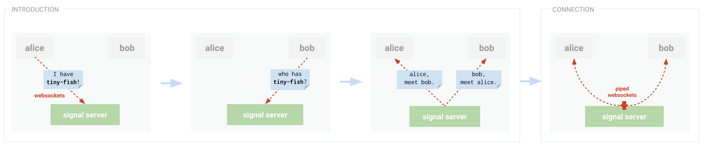

# cevitxe-signal-server

This server provides two services:

- **Introduction** (aka discovery): A client can provide one or more document keys that they're
  interested in. If any other client is interested in the same key or keys, each will receive an
  `Introduction` message with the other's id. They can then use that information to connect.

- **Connection**: Client A can request to connect with Client B on a given document ID (can think of
  it as a 'channel'). If we get matching connection requests from A and B, we just pipe their
  sockets together.



## Deployment

The easiest way to stand one of these up is to use the [cevitxe-signal-server-standalone] repo,
which is optimized for deployment. In that repo you'll find instructions for deploying to Heroku,
AWS Elastic Beanstalk, Google Cloud Platform, and Glitch.

## Usage

The client that we've written for this server is the easiest way to use it. See the instructions for
[cevitxe-signal-client] for details.

## API

This server has two WebSocket endpoints: `introduction` and `connect`.

#### `/introduction/:localId`

- I connect to this endpoint, e.g. `wss://your.domain.com/introduction/aaaa4242`. (`:localId` is a string that identifies me uniquely).
- Once a WebSocket connection has been made, I send an introduction request containing one or more
  document IDs I'm interested in joining:

  ```ts
  {
    type: 'Join',
    join: ['happy-raccoon', 'qrs987'], // documents I'm interested in
  }
  ```

- If another peer is connected to the same server and interested in one or more of the same
  documents IDs, the server sends me an introduction message:

  ```ts
  {
    type: 'Introduction',
    id: 'qrst7890', // the peer's id
    keys: ['abcd1234'] // documents we're both interested in
  }
  ```

- I can now use this information to request a connection to this peer:

#### `/connection/:remoteId`

To connect to a peer, I make a new connection to this endpoint, e.g. `wss://your.domain.com/connect/qrst7890`. (`:remoteId` is the peer's unique client identifier.)

At this point the server doesn't pay attention to the messages going

The [server tests] in this repo provide good examples of how to use this API directly.

## License

MIT

## Prior art

Inspired by https://github.com/orionz/discovery-cloud-server

[cevitxe-signal-client]: https://github.com/devresults/cevitxe/blob/master/packages/cevitxe-signal-client/README.md
[cevitxe-signal-server-standalone]: https://github.com/DevResults/cevitxe-signal-server-standalone
[server tests]: https://github.com/DevResults/cevitxe/blob/master/packages/cevitxe-signal-server/src/Server.test.ts
